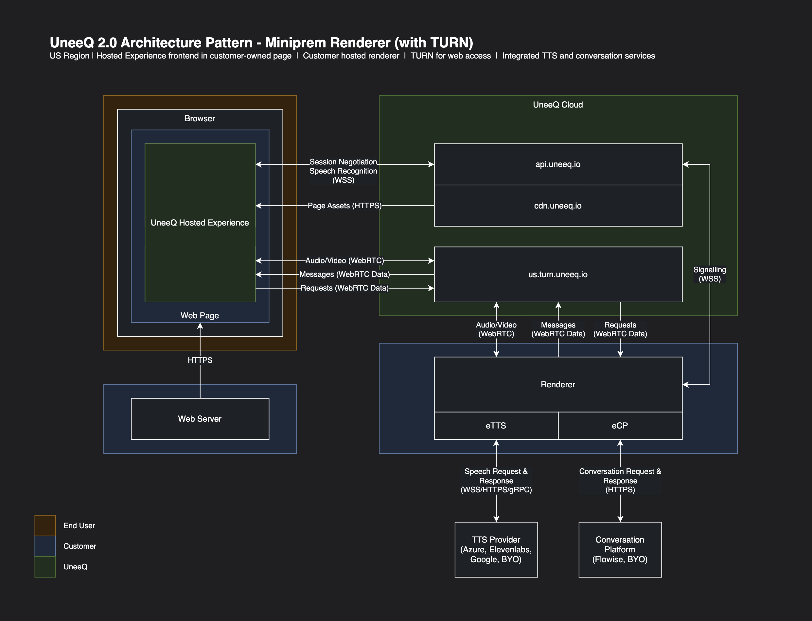
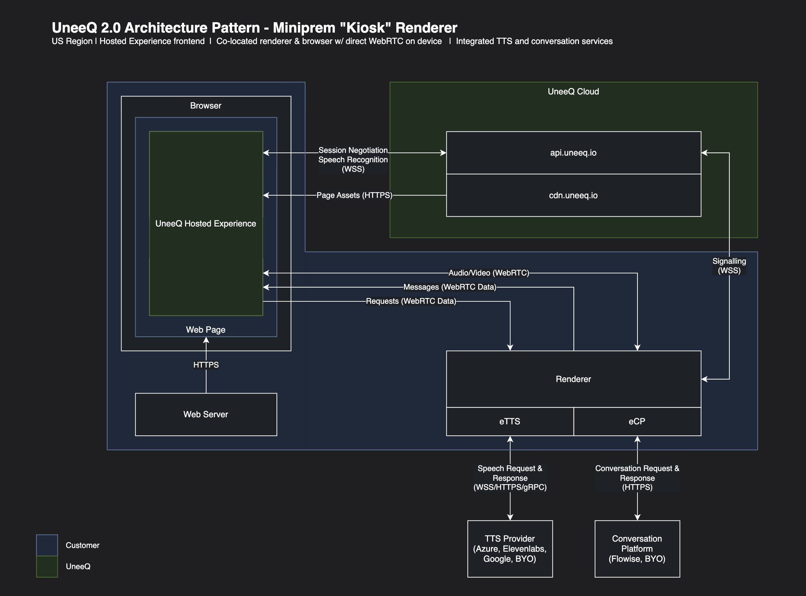

<div align="center">


# MiniPrem Platform

> A comprehensive digital human platform with LLM integration, real-time facial animation, and monitoring capabilities.

</div>

## Table of Contents

- [Overview](#overview)
- [Architecture Diagrams](#architecture-diagrams)
  - [Cloud-Based Architecture (UneeQ Hosted TURN)](#cloud-based-architecture-uneeq-hosted-turn)
  - [Kiosk Architecture (Same-Machine Deployment)](#kiosk-architecture-same-machine-deployment)
- [Features](#features)
- [Quick Start](#quick-start)
  - [Prerequisites](#prerequisites)
  - [Installation](#installation)
- [Accessing Services](#accessing-services)
- [Managing MiniPrem](#managing-miniprem)
- [Internal Speech Processing (NEW_SPEECH_OVERRIDE)](#internal-speech-processing-new_speech_override)
- [Docker Configuration](#docker-configuration)
- [Kubernetes/EKS Deployment](#kuberneteseks-deployment)
- [Additional Documentation](#additional-documentation)
- [License](#license)
- [Copyright](#copyright)

## Overview

MiniPrem is an integrated platform that combines a digital human interface (Renny) with advanced internal speech processing, LLM capabilities (vLLM), workflow automation (Flowise), and comprehensive monitoring tools (Prometheus + Grafana). This setup allows you to deploy and manage advanced AI interactions through a virtual human interface with simplified, more reliable speech generation.

## Architecture Diagrams

MiniPrem supports multiple deployment architectures to fit different use cases:

### Cloud-Based Architecture (UneeQ Hosted TURN)

This architecture leverages UneeQ's hosted TURN servers for optimal network traversal and WebRTC connectivity. Ideal for production deployments where the MiniPrem server is hosted in a data center or cloud environment.



**Key Characteristics:**
- 🌐 **UneeQ Hosted TURN**: Reliable WebRTC connectivity through UneeQ's global TURN infrastructure
- 🖥️ **Remote Server Deployment**: MiniPrem components run on dedicated server hardware or cloud instances
- 🔄 **Scalable Architecture**: Supports multiple concurrent users with load balancing
- 📡 **Network Traversal**: TURN servers handle NAT traversal and firewall complexities
- 🔒 **Secure Communication**: End-to-end encrypted WebRTC streams

**Use Cases:**
- Production deployments with multiple concurrent users
- Enterprise installations requiring high availability
- Remote access scenarios with complex network topologies
- Multi-location deployments with centralized infrastructure

### Kiosk Architecture (Same-Machine Deployment)

This architecture is optimized for kiosk deployments where the user's browser and MiniPrem services run on the same physical machine. This configuration provides the lowest possible latency for real-time digital human interactions.



**Key Characteristics:**
- 🖥️ **Single Machine**: Browser and MiniPrem services run locally on the same hardware
- ⚡ **Ultra-Low Latency**: Direct localhost communication eliminates network latency
- 🎯 **Simplified Network**: No TURN servers required - direct peer connection
- 💻 **Standalone Operation**: Can operate without internet connectivity (after initial setup)
- 🔧 **Easy Maintenance**: Single point of management for updates and troubleshooting

**Use Cases:**
- Trade show kiosks and exhibition booths
- Retail environments with customer-facing terminals
- Public spaces (museums, airports, shopping centers)
- Offline or limited-connectivity scenarios
- Demo and testing environments

**Technical Considerations:**
- Recommended: Dedicated GPU for optimal rendering performance
- Display should face the user, with optional external camera placement
- Audio system calibration important for speech recognition accuracy
- Consider touchscreen interface for accessibility

## Features

- **Digital Human Interface**: Powered by Renny, with internal speech processing and real-time facial animation
- **LLM Integration**: vLLM running Gemma3 for natural language understanding
- **LLM Integration**: vLLM running Mistral-7B-Instruct-v0.3 for natural language understanding
- **Workflow Automation**: Flowise for building and managing AI workflows
- **Metrics & Monitoring**: Prometheus and Grafana for real-time performance tracking
- **Queue Management**: Redis for reliable message processing
- **RIME AI**: High-quality text-to-speech via a simple API
- **Whisper**: OpenAI's speech recognition for accurate audio transcription
- **Internal Speech Processing**: Advanced speech system with NEW_SPEECH_OVERRIDE for enhanced performance

## Quick Start

### Prerequisites

- Docker and Docker Compose
- NVIDIA GPU with appropriate drivers
- Ubuntu Linux (recommended)
- HuggingFace account with API token
- Required credentials from UneeQ (platform address, API key, tenant ID)
- Azure Speech service credentials (region and API key)

### Installation

1. Clone this repository:
   ```bash
   git clone https://gitlab.com/tgmerritt/miniprem-2025.git
   cd miniprem-2025
   ```

2. Run the installation script:

   ```bash
   ./docker/scripts/install_miniprem.sh
   ```

   The installer will prompt you to select either a **Default Install** (Renny only) or a **Full Install** (all services: Renny, Flowise, vLLM, Grafana, Prometheus, RIME, etc.).

   You can re-run the installer at any time to upgrade from Default to Full, or to change your selection.

3. The script will prompt you for the following required information:

   - **UneeQ platform address**: The base URL for your UneeQ platform
   - **UneeQ platform API key**: Authentication key provided by UneeQ
   - **Tenant ID**: Your UneeQ tenant identifier
   - **Azure region**: Region for your Azure Speech service (e.g., eastus)
   - **Azure speech key**: Authentication key for Azure Speech service
   - **Renny image name**: Docker image for the Renny digital human

   You can also provide these values directly as command-line arguments:

   ```bash
   ./docker/scripts/install_miniprem.sh --platform-address <address> --platform-key <key> --tenant-id <id> --azure-region <region> --azure-speech-key <key> --renny-image <image>
   ```

4. The installation process will:
   - Check system prerequisites
   - Configure required files
   - Verify cloud service connectivity
   - Build and start all required Docker containers
   - Download the Gemma3 LLM model (this may take 5-15 minutes)
   - Set up the initial Flowise chatflow

## Accessing Services

Once installation is complete, you can access the following services:

| Service | URL | Default Credentials | Notes |
|---------|-----|---------------------|-------|
| **MiniPrem Monitor** | **http://localhost:3001** | N/A | **Host network mode** - Direct port binding |
| Flowise | http://localhost:3000 | user / password | Bridge network mode |
| Grafana | http://localhost:3002 | admin / admin | Bridge network mode |
| Prometheus | http://localhost:9090 | N/A | Bridge network mode |
| vLLM API | http://localhost:8000 | N/A | Bridge network mode |
| Renny Health | http://localhost:8081/health | N/A | Bridge network mode |
| RIME API | http://localhost:8100 | Requires API Key | Bridge network mode |

**Networking Note**: MiniPrem Monitor uses host networking for direct Docker socket and Kubernetes access. All other services use standard bridge networking.

### Using Flowise

1. Access Flowise at http://localhost:3000
2. Log in with the default credentials (user / password)
3. Navigate to the pre-configured chatflow for interacting with the vLLM LLM
4. Test the chatflow by sending messages through the chat interface

### Testing vLLM API with cURL

You can test the vLLM API directly with a cURL command:

```bash
curl -X POST http://localhost:8000/v1/chat/completions \
  -H 'Content-Type: application/json' \
  -d '{
    "model": "facebook/opt-125m",
    "messages": [
        {"role": "system", "content": "You are a helpful AI assistant."},
        {"role": "user", "content": "What is artificial intelligence?"}
    ]
  }'
```

### MiniPrem Monitor (Container & Kubernetes Monitoring)

**Primary monitoring dashboard for Docker containers and Kubernetes pods.**

**Quick Access:** http://localhost:3001

**Key Features:**
- 📊 Real-time container status and resource usage
- 📝 Live log streaming from any container or pod
- 🔄 Monitor both local Docker and remote Kubernetes clusters
- 🎯 Multi-cluster support with kubectl context switching
- 🌐 Host networking for optimal performance and direct system access

**Architecture:**
- Uses Docker host networking (`network_mode: host`) for direct socket access
- Frontend binds to port 3001, backend to port 8000 (internal)
- Single container deployment with supervisord
- Read-only Docker socket and kubeconfig mounts for security

**📖 Complete Documentation:** [MiniPrem Monitor README](miniprem-monitor/README.md)
- Architecture and networking details
- Security features and command whitelisting
- Troubleshooting guide
- Development setup

### Monitoring with Grafana

1. Access Grafana at http://localhost:3002
2. Log in with the default credentials (admin / admin)
3. Navigate to Dashboards to view the pre-configured Flowise monitoring dashboard
4. Create custom dashboards as needed to monitor specific metrics

### Using RIME AI (Text-to-Speech)

RIME provides high-quality text-to-speech via a simple API. You must supply your RIME API key in the Authorization header.

**Example: JSON response**
```bash
curl -X POST "http://localhost:8100" \
  -H "Authorization: Bearer <API KEY>" \
  -H "Content-Type: application/json" \
  -d '{
    "text": "I would love to have a conversation with you. The new model is out.",
    "speaker": "joy",
    "modelId": "mist"
  }' -o result_mist.txt
```

**Example: MP3 response**
```bash
curl -X POST "http://localhost:8100" \
  -H "Authorization: Bearer <API KEY>" \
  -H "Content-Type: application/json" \
  -H "Accept: audio/mp3" \
  -d '{
    "text": "I would love to have a conversation with you.",
    "speaker": "joy",
    "modelId": "mist"
  }' -o result.mp3
```

**Example: PCM response**
```bash
curl -X POST "http://localhost:8100" \
  -H "Authorization: Bearer <API KEY>" \
  -H "Content-Type: application/json" \
  -H "Accept: audio/pcm" \
  -d '{
    "text": "I would love to have a conversation with you.",
    "speaker": "joy",
    "modelId": "mist"
  }' -o result.pcm
```

## Managing MiniPrem

Use the included `miniprem.sh` script to manage the platform:

```bash
# Start all services
./miniprem.sh start

# Check service status
./miniprem.sh status

# View logs
./miniprem.sh logs

# Stop all services
./miniprem.sh stop

# Restart all services
./miniprem.sh restart

# Run Flowise chatflow setup (only available in Full Install)
./miniprem.sh setup
```

The services started will depend on your installation type (Default or Full) as specified during installation. The installation type is saved in the `.miniprem_install_type` file. To switch between installation types, simply run the installer again and select a different option.

### Default Install Services
* MiniPrem Monitor (Container/Kubernetes Monitoring)
* Renny (Digital Human with Internal Speech Processing)

### Full Install Services
* All services in Default Install, plus:
* Flowise (Workflow Automation)
* vLLM (LLM Inference)
* Prometheus (Metrics Collection)
* Grafana (Monitoring Dashboard)
* Redis (Queue Management)
* RIME (Text-to-Speech API)

## Monitoring Deployment Scenarios

MiniPrem Monitor can be deployed in multiple configurations depending on your use case:

### Scenario 1: Full MiniPrem Stack (Default)
**Use Case:** Complete digital human platform with integrated monitoring
**Command:** `./miniprem.sh start` (after running full installation)
**Services:** Renny + vLLM + Flowise + Grafana + Prometheus + Redis + MiniPrem Monitor
**Access:** http://localhost:3001

This is the standard deployment for running the complete MiniPrem platform locally with all AI services and monitoring capabilities.

### Scenario 2: Standalone Monitor (Kubernetes Monitoring)
**Use Case:** Monitor production Kubernetes/EKS cluster alongside local Docker containers
**Command:**
```bash
cd docker
docker-compose -f docker-compose.monitor.yml up -d
```
**Services:** MiniPrem Monitor only
**Access:** http://localhost:3001
**Prerequisites:** kubectl configured with cluster access

This deployment is ideal for platform operations teams who need to monitor remote Kubernetes clusters while also tracking local development containers. The monitor automatically detects configured kubectl contexts and allows switching between clusters.

### Scenario 3: Minimal Stack (Renny + Monitor)
**Use Case:** Resource-constrained environments with basic digital human functionality
**Command:** `./miniprem.sh start` (after running default installation)
**Services:** Renny + MiniPrem Monitor
**Access:** http://localhost:3001

This minimal deployment provides the Renny digital human interface with container monitoring, without the full AI/LLM stack.

**For detailed monitoring documentation, including architecture, troubleshooting, and advanced configuration, see [MiniPrem Monitor README](miniprem-monitor/README.md).**

## Internal Speech Processing (NEW_SPEECH_OVERRIDE)

MiniPrem v5.6mha introduces an advanced internal speech processing system, providing improved reliability and performance.

### Key Benefits:
- **🚀 Enhanced Performance**: Speech and facial animation processing occurs internally within Renny
- **🔧 Improved Reliability**: Eliminates network dependencies between speech and animation services
- **💰 Cost Reduction**: Fewer containers and resources required
- **🛠️ Simplified Management**: Single service handles both speech processing and facial animation

### Configuration:
The internal speech system is enabled via the `NEW_SPEECH_OVERRIDE=1` environment variable, which:
- Activates Renny's built-in speech processing engine
- Handles text-to-speech conversion internally
- Generates synchronized facial animations automatically
- Provides fallback to Azure Speech Services if needed

This represents a significant architectural improvement, moving from a multi-service approach to a streamlined, integrated solution.

## Docker Configuration

MiniPrem uses two main Docker Compose files:

* `docker/docker-compose.default.yml` - Used for Default Install (Renny only)
* `docker/docker-compose.yml` - Used for Full Install (all services)

The appropriate file is automatically selected based on your installation type.

For Docker management commands and tips, see the [Docker documentation](https://docs.docker.com/) or run `docker --help`.

## Troubleshooting

For comprehensive troubleshooting guidance, see:
- [Troubleshooting Guide](docs/troubleshooting.md) - Common issues and solutions
- **Docker Issues**: `docker logs <container_name>` to view service logs
- **GPU Issues**: Run `nvidia-smi` to verify GPU availability
- **Configuration Issues**: Check `docker/configuration.dat` for correct UneeQ credentials

**Quick Diagnostic Commands:**
```bash
./miniprem.sh status  # Check service status
docker ps -a          # View all containers
nvidia-smi            # Verify GPU
```

For persistent issues, contact UneeQ support with service logs.


## Kubernetes/EKS Deployment

### 🚀 Production-Ready Kubernetes Deployment

MiniPrem includes a complete **one-click EKS deployment solution** for production environments with:

- **✅ Auto-scaling GPU clusters** (10-20 Renny instances)
- **✅ NVIDIA GPU Operator** with automatic driver management  
- **✅ High availability** across multiple availability zones
- **✅ Cost optimization** with GPU time-slicing and auto-scaling
- **✅ Production monitoring** with CloudWatch integration

**📍 Location**: [`kubernetes/`](kubernetes/) directory contains the complete EKS deployment

**⚡ Quick Start**:
```bash
cd kubernetes
./scripts/deploy.sh  # Complete deployment in ~30-45 minutes
```

### NVIDIA Driver Management (Kubernetes/EKS)

#### Driver Version Selection

The EKS deployment automatically handles NVIDIA GPU Operator installation. You'll be prompted to choose:

1. **🚀 Driver 580+** (Recommended Default)
   - ✅ Latest NVIDIA driver features and optimizations
   - ✅ **REQUIRED for NVIDIA 5xxx series GPUs** (RTX 5090, etc.)
   - ✅ Enhanced performance improvements
   - ✅ Full graphics and compute capabilities
   - ✅ CUDA 12.8+ support
   - ✅ Production-ready and stable

2. **📋 Driver 575+** (Alternative for Older GPUs)
   - ✅ Verified and tested configuration
   - ✅ Maximum stability for legacy hardware
   - ✅ Enhanced graphics capabilities
   - ✅ `compute,utility,graphics` driver capabilities
   - ✅ Vulkan API support for Unreal Engine 5.6+

#### Upgrading NVIDIA Drivers

⚠️ **Important**: Due to a Helm limitation with comma-separated values, use values files instead of `--set`:

```yaml
# gpu-upgrade.yaml
driver:
  version: "575.57.08"
  env:
    - name: NVIDIA_DRIVER_CAPABILITIES
      value: "compute,utility,graphics"
```

```bash
helm upgrade gpu-operator nvidia/gpu-operator -n gpu-operator -f gpu-upgrade.yaml
kubectl get pods -n gpu-operator -l app=nvidia-driver-daemonset -w
```

#### GPU Status Monitoring

```bash
# Check GPU availability across cluster
kubectl get nodes -L nvidia.com/gpu,uneeq.io/node-type

# Monitor GPU operator installation
kubectl get pods -n gpu-operator

# Test GPU functionality
kubectl exec -n gpu-operator $(kubectl get pods -n gpu-operator -l app=nvidia-driver-daemonset -o name | head -1) -- nvidia-smi
```

### 📖 Complete Documentation

For detailed Kubernetes deployment instructions, troubleshooting, and advanced configuration:

**➡️ [Kubernetes Deployment Guide](kubernetes/README.md)**

- Prerequisites and tool installation
- AWS credentials and VPC setup  
- GPU driver troubleshooting
- Known issues and solutions
- Production monitoring with CloudWatch

## Additional Documentation

For more detailed information, refer to the following guides:

- [Flowise Configuration](docs/guides/flowise.md)
- [Monitoring with Prometheus and Grafana](docs/guides/monitoring.md)
- [Renny Integration](docs/guides/renny.md)
- [vLLM Integration](docs/guides/vllm.md)
- [vLLM Official Documentation](https://vllm.readthedocs.io/en/latest/)

## License

This project is licensed under the MIT License - see the [LICENSE](LICENSE) file for details.

---

## Copyright

<div align="center">

**© 2025 UneeQ. All rights reserved.**


**Digital Humans. Unlimited Possibilities.**

[www.digitalhumans.com](https://www.digitalhumans.com) | [support@digitalhumans.com](mailto:support@digitalhumans.com)

</div>
