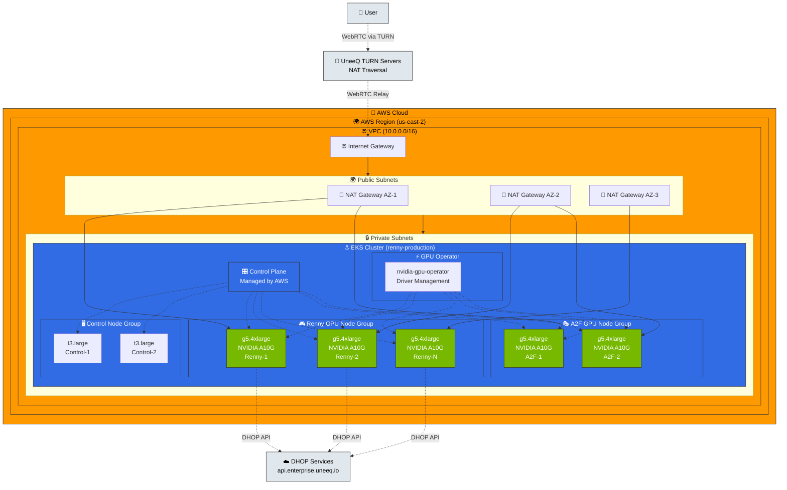
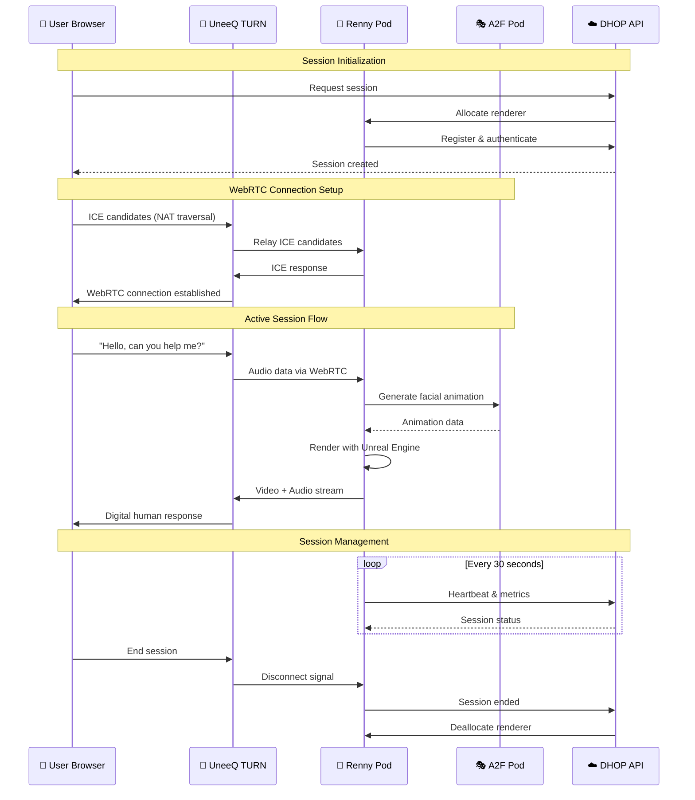
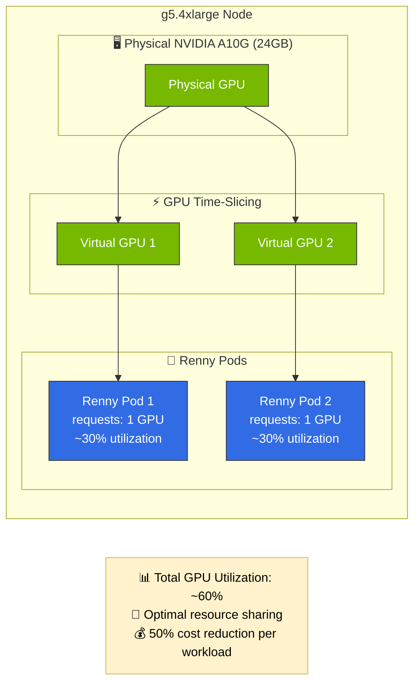

# Renny EKS Deployment Solution

## Table of Contents

1. [Architecture Diagrams](#architecture-diagrams)
2. [Folder Structure](#-folder-structure)
3. [Quick Start](#-quick-start)
   - [Prerequisites](#prerequisites)
   - [Setup AWS Credentials](#step-0-setup-aws-credentials)
   - [Configure Credentials](#step-1-configure-credentials)
   - [Place Helm Chart](#step-2-place-helm-chart)
   - [Deploy](#step-3-deploy)
4. [Architecture](#-architecture)
5. [Text-to-Speech Configuration](#-text-to-speech-configuration)
6. [Operations](#-operations)
7. [Troubleshooting & Debugging](#-troubleshooting--debugging)
8. [Kubernetes Debugging & Monitoring](#-kubernetes-debugging--monitoring)
9. [CloudWatch Logs](#-cloudwatch-logs---application-error-monitoring)
10. [Security Considerations](#-security-considerations)
11. [Cost Optimization](#-cost-optimization)
12. [Support](#-support)
13. [Updates and Maintenance](#-updates-and-maintenance)

This folder contains a complete one-click deployment solution for Renny on AWS EKS with GPU support.

## 📁 Folder Structure

```
kubernetes/
├── terraform/           # Infrastructure as Code
│   ├── main.tf         # Main Terraform configuration
│   ├── variables.tf    # Variable definitions
│   ├── outputs.tf      # Output definitions
│   ├── vpc.tf          # VPC configuration
│   ├── eks.tf          # EKS cluster configuration
│   ├── node-groups.tf  # Node group configurations (Ubuntu EKS AMIs)
│   ├── ubuntu_userdata.sh  # Ubuntu bootstrap script
│   └── iam.tf          # IAM roles and policies
├── manifests/          # Kubernetes manifests
│   ├── namespace.yaml  # Namespace definition
│   ├── gpu-operator.yaml
│   └── autoscaler.yaml
├── values/             # Helm chart values
│   ├── renny-values.yaml
│   └── a2f-values.yaml
├── scripts/            # Deployment scripts
│   ├── deploy.sh       # One-click deployment (~30-45 min)
│   ├── scale.sh        # Scale Renny instances
│   ├── destroy.sh      # Full cleanup (~15-20 min)
│   ├── status.sh       # Check deployment status
│   ├── cleanup.sh      # Emergency cleanup (no confirmations)
│   ├── check-aws-prerequisites.sh # Verify AWS setup
│   └── check-vpc-usage.sh # Analyze VPC usage and limits
└── README.md           # This file
```

## 🚀 Quick Start

### Prerequisites

1. **AWS Account** with appropriate permissions (see [AWS_SETUP.md](AWS_SETUP.md))
2. **AWS CLI** >= 2.3.0 configured with credentials ⚠️ **IMPORTANT VERSION REQUIREMENT**
3. **Terraform** >= 1.0 (see installation below)
4. **kubectl** 
5. **Helm** >= 3.0
6. **Docker Hub** account with access to UneeQ repositories
7. **Renny Helm chart** (renny-chart.tar file)

#### Install Required Tools

**Terraform Installation:**

*macOS:*
```bash
# Using Homebrew (recommended)
brew tap hashicorp/tap
brew install hashicorp/tap/terraform

# Or download binary
curl -LO https://releases.hashicorp.com/terraform/1.6.6/terraform_1.6.6_darwin_arm64.zip
unzip terraform_1.6.6_darwin_arm64.zip
sudo mv terraform /usr/local/bin/
```

*Linux:*
```bash
# Using package manager (Ubuntu/Debian)
wget -O- https://apt.releases.hashicorp.com/gpg | sudo gpg --dearmor -o /usr/share/keyrings/hashicorp-archive-keyring.gpg
echo "deb [signed-by=/usr/share/keyrings/hashicorp-archive-keyring.gpg] https://apt.releases.hashicorp.com $(lsb_release -cs) main" | sudo tee /etc/apt/sources.list.d/hashicorp.list
sudo apt update && sudo apt install terraform

# Or download binary
wget https://releases.hashicorp.com/terraform/1.6.6/terraform_1.6.6_linux_amd64.zip
unzip terraform_1.6.6_linux_amd64.zip
sudo mv terraform /usr/local/bin/
```

*Windows:*
```powershell
# Using Chocolatey (recommended)
choco install terraform

# Using Scoop
scoop install terraform

# Or download binary from https://releases.hashicorp.com/terraform/
# Extract and add to PATH
```

**Other Tools:**

*AWS CLI:*
- macOS: `brew install awscli`
- Linux: `pip install awscli` or use package manager
- Windows: Download from AWS or `choco install awscli`

*kubectl:*
- macOS: `brew install kubectl`
- Linux: `sudo snap install kubectl --classic`
- Windows: `choco install kubernetes-cli`

*Helm:*
- macOS: `brew install helm`
- Linux: `sudo snap install helm --classic`
- Windows: `choco install kubernetes-helm`

**Verify Installations:**
```bash
terraform version  # Should show v1.6.6 or higher
aws --version      # AWS CLI version
kubectl version    # Kubernetes CLI
helm version       # Helm package manager
```


### Step 0: Setup AWS Credentials

The deployment script is **profile-aware** and will detect your current AWS configuration automatically.

#### **Option 1: AWS SSO (Recommended for Organizations)**

```bash
# Login to your SSO profile
aws sso login --profile your-org-profile

# Run deployment with specific profile
./scripts/deploy.sh --profile your-org-profile

# Or set environment variable
export AWS_PROFILE=your-org-profile
./scripts/deploy.sh
```

#### **Option 2: IAM User (For Testing)**

1. Create an IAM user in AWS Console with:
   - `PowerUserAccess` policy
   - `IAMFullAccess` policy
   - `AmazonEKSClusterPolicy` policy
2. Configure AWS CLI:
   ```bash
   aws configure
   # Enter Access Key ID and Secret Access Key
   # Region: your preferred region (default: us-east-2)
   ```

#### **AWS Profile Detection**

The deployment script will automatically:
- ✅ **Detect** your current AWS profile and credentials
- ✅ **Display** account ID, region, and identity information  
- ✅ **Confirm** you're using the correct profile before proceeding
- ✅ **Provide** clear instructions if credentials are missing or expired

**Verify your AWS setup:**
```bash
# Check prerequisites with current profile
./scripts/check-aws-prerequisites.sh

# Check prerequisites with specific profile
./scripts/check-aws-prerequisites.sh --profile your-profile-name
```

**Check VPC availability (important - AWS has VPC limits):**
```bash
./scripts/check-vpc-usage.sh
```

This deployment creates a new VPC, so you need to ensure you haven't hit the VPC limit (5 per region by default). The VPC checker helps you:
- Analyze VPC usage across all AWS services 
- Identify unused VPCs that can be safely deleted
- Check specific VPCs or regions

**VPC Checker Usage Examples:**
```bash
# Check all VPCs in your configured region
./scripts/check-vpc-usage.sh

# Check VPCs in a specific region
./scripts/check-vpc-usage.sh --region us-west-2

# Analyze a specific VPC 
./scripts/check-vpc-usage.sh --vpc vpc-123456789

# Analyze specific VPC in specific region
./scripts/check-vpc-usage.sh --region us-west-2 --vpc vpc-123456789
```

The script will show you which VPCs are safe to delete and provide deletion commands if needed.

For detailed AWS setup instructions, see [AWS_SETUP.md](AWS_SETUP.md).

### Step 1: Configure Credentials

Create `terraform/terraform.tfvars` with your credentials:

```hcl
# Required credentials
dhop_tenant_id  = "your-tenant-id"
dhop_api_key    = "your-api-key"  # Plain text API key
docker_username = "your-dockerhub-username"
docker_password = "your-dockerhub-password"

# Optional: Override defaults
aws_region = "us-east-2"  # Change to your preferred region
```

The region will be used by all scripts automatically. You can also override other settings like instance types and scaling parameters - see `terraform.tfvars.example` for all options.

### Step 2: Place Helm Chart

Place your `renny-chart.tgz` file in the `kubernetes/` directory.

### Step 3: Deploy

Run the one-click deployment:

```bash
cd kubernetes
chmod +x scripts/*.sh

# Basic deployment (will prompt for profile confirmation)
./scripts/deploy.sh

# With specific AWS profile
./scripts/deploy.sh --profile your-profile-name

# Skip profile confirmation (for automation)
./scripts/deploy.sh --skip-profile-check

# Get help
./scripts/deploy.sh --help
```

This will:
1. ✅ Check prerequisites
2. 🏗️ Deploy VPC and EKS cluster via Terraform (~15-20 minutes)  
3. 🚀 Fast cluster join for Ubuntu nodes (~3-5 minutes)
4. 🎮 Install NVIDIA GPU Operator for automatic driver installation (~5-10 minutes)
5. 🎭 Deploy Audio2Face on dedicated GPU nodes (~3-5 minutes)
6. 🤖 Deploy Renny on separate GPU nodes (10 instances) (~5-10 minutes)
7. ⚖️ Configure autoscaling (10-20 instances)

**Total deployment time: ~30-45 minutes**

**Key Improvement**: Ubuntu nodes join the cluster quickly (~3 minutes) without waiting for NVIDIA driver compilation, then GPU Operator installs drivers automatically in the background.

## 📊 Architecture Diagrams

### Infrastructure Overview

This diagram shows the complete AWS EKS infrastructure including networking, nodes, and external connectivity:



### Active Session Architecture

This diagram shows the data flow during an active digital human session:



### GPU Time-Slicing Configuration

This diagram shows how GPU time-slicing allows multiple Renny pods per GPU:



## 📊 Technical Architecture

### Cluster Configuration

- **Region**: Configurable (default: us-east-2)
- **Kubernetes Version**: 1.31
- **Operating System**: Ubuntu 22.04 EKS AMIs for GPU nodes (optimized for Vulkan/Unreal Engine)
- **Node Groups**:
  - **Control Plane**: 2x t3.large nodes (for management)
  - **Renny Nodes**: 10-20x g5.4xlarge GPU instances (Ubuntu)
  - **A2F Nodes**: 2-5x g5.4xlarge GPU instances (Ubuntu)

### GPU Configuration & Compatibility

This deployment uses **Ubuntu 22.04 EKS AMIs** with an optimized GPU driver installation approach:

**Fast Cluster Join Approach:**
- **Phase 1**: Nodes join cluster quickly (~3 minutes) without GPU drivers
- **Phase 2**: NVIDIA GPU Operator automatically installs drivers (~5-10 minutes)
- **Result**: Faster deployment and automatic driver management

**GPU Capabilities:**
- **NVIDIA Driver 570+**: Latest drivers for RTX/A10G GPU support (via GPU Operator)
- **CUDA 12.4+**: Modern CUDA runtime for Unreal Engine 5.6 compatibility  
- **Vulkan API Support**: Full Vulkan graphics pipeline support for Renny rendering
- **150GB EBS Storage**: Accommodates large AI container images (35GB+)

**Why Ubuntu over Amazon Linux?**
- **Vulkan Compatibility**: Ubuntu provides complete Vulkan API support required by Unreal Engine
- **Graphics Stack**: More comprehensive graphics libraries and driver ecosystem
- **GLIBC 2.35**: Modern system libraries required by latest Unreal Engine builds
- **Container Compatibility**: Better compatibility with AI/ML container images

### Network Architecture

```
Internet → ALB/NLB → EKS Cluster
                      ├── GPU Node Group (Renny)
                      │   └── 10-20 g5.4xlarge instances
                      ├── GPU Node Group (A2F)
                      │   └── 2-5 g5.4xlarge instances
                      └── Control Node Group
                          └── 2 t3.large instances
```

### Port Configuration

- **WebRTC/UDP**: 22000-23000 (for PixelStreaming)
- **TURN/STUN**: 3478 (TCP/UDP)
- **HTTPS**: 443 (egress to *.uneeq.io)

## 🗣️ Text-to-Speech Configuration

Renny supports multiple TTS providers. All API keys should be provided as **plain text** (not base64 encoded) in `values/renny-values.yaml`:

### Azure Speech Services
```yaml
tts:
  azureRegion: "eastus"  # Your Azure region
  azureSpeechKey: "your-azure-api-key"  # Plain text API key
```

### ElevenLabs
```yaml
tts:
  elevenlabsApiKey: "sk_your-elevenlabs-api-key"  # Plain text API key starting with 'sk_'
```

### Google Cloud TTS
```yaml
tts:
  gcpCredentials: "{\"type\": \"service_account\", ...}"  # JSON service account key as string
```

**Apply changes:**
```bash
helm upgrade renny ./renny-chart.tgz -n uneeq-renderer -f values/renny-values.yaml
```

**Note:** The Helm template automatically base64-encodes these values when creating Kubernetes secrets. You don't need to encode them manually.

## 🔧 Operations

### Scaling Renny Instances

Scale between 10-20 instances:

```bash
./scripts/scale.sh 15  # Scale to 15 instances
```

### Check Deployment Status

Get a comprehensive status report:
```bash
./scripts/status.sh
```

### Check GPU Driver Installation

After deployment completes, verify GPU operators and drivers are working:

```bash
# Check GPU operator pods (should all be Running/Completed)
kubectl get pods -n gpu-operator

# Verify GPU drivers are installed on all GPU nodes
kubectl get nodes -l nvidia.com/gpu.present=true

# Test GPU functionality with nvidia-smi
kubectl run gpu-test --image=nvidia/cuda:11.0-runtime-ubuntu18.04 --rm -it --restart=Never \
  --overrides='{"spec":{"nodeSelector":{"uneeq.io/node-type":"renny"},"tolerations":[{"key":"nvidia.com/gpu","operator":"Equal","value":"true","effect":"NoSchedule"}]}}' \
  -- nvidia-smi

# Check GPU resource allocation on nodes
kubectl describe nodes -l uneeq.io/node-type=renny | grep nvidia.com/gpu
```

**Expected Results:**
- All GPU operator pods should be `Running` or `Completed`
- GPU nodes should have label `nvidia.com/gpu.present=true`
- `nvidia-smi` should show NVIDIA driver 570+ installed
- Nodes should show `nvidia.com/gpu: 1` in allocatable resources

### Monitoring

#### kubectl Context Management

**Important**: After deployment, `kubectl` automatically connects to your EKS cluster. Verify this with:

```bash
# Check which cluster kubectl is connected to
kubectl config current-context
# Should show: arn:aws:eks:us-east-2:722136182380:cluster/renny-production

# If you need to reconnect to the EKS cluster later:
aws eks update-kubeconfig --region us-east-2 --name renny-production --profile your-profile

# List all available contexts (if you have multiple clusters)
kubectl config get-contexts

# Switch between contexts
kubectl config use-context <context-name>
```

#### Deployment Status Monitoring

**During Deployment** (while script is running):
```bash
# Check node readiness and types
kubectl get nodes -L uneeq.io/node-type,nvidia.com/gpu

# Monitor GPU operator installation progress
kubectl get pods -n gpu-operator

# Check namespace creation
kubectl get namespaces

# View all pod statuses across namespaces
kubectl get pods --all-namespaces
```

**After Deployment** (when applications are running):
```bash
# Check Renny and A2F pods
kubectl get pods -n uneeq-renderer

# Check GPU operator status
kubectl get pods -n gpu-operator

# Check node-specific GPU availability
kubectl describe nodes -l uneeq.io/node-type=renny

# View detailed pod status
kubectl describe pods -n uneeq-renderer
```

## 🔧 Troubleshooting & Debugging

### Pod Debugging Commands

**When pods are stuck in `ContainerCreating`, `Pending`, or `ErrImagePull`:**

```bash
# 1. Check overall pod status
kubectl get pods -n uneeq-renderer -o wide

# 2. Watch pods in real-time (Ctrl+C to exit)
kubectl get pods -n uneeq-renderer -w

# 3. Check detailed events for specific pod
kubectl describe pod -n uneeq-renderer <pod-name>

# 4. Check recent events across namespace
kubectl get events -n uneeq-renderer --sort-by='.lastTimestamp' | tail -20

# 5. Check logs for running pods
kubectl logs -n uneeq-renderer <pod-name> -c <container-name>

# 6. Check node resources and scheduling issues
kubectl describe nodes -l uneeq.io/node-type=renny | grep -A10 "Allocated resources"
kubectl describe nodes -l uneeq.io/node-type=a2f | grep -A10 "Allocated resources"
```

**Common Issues & Solutions:**

- **`ErrImagePull/ImagePullBackOff`**: Check Docker authentication
  ```bash
  kubectl get secret docker-config -n uneeq-renderer
  ```

- **`FailedMount`**: Check secret keys exist
  ```bash
  kubectl get secret renderer -n uneeq-renderer -o yaml
  ```

- **`Insufficient resources`**: Check node capacity
  ```bash
  kubectl top nodes
  kubectl describe nodes | grep -E "(Name:|Allocated resources:)" -A10
  ```

- **Long `ContainerCreating`**: Large images (35GB+) take 10-20 minutes
  ```bash
  # Check image pull progress
  kubectl describe pod -n uneeq-renderer <pod-name> | grep -E "(Pulling|Pulled)"
  ```

### Interactive Debugging

**Connect to running containers:**
```bash
# Debug Renny container
kubectl exec -it -n uneeq-renderer <renny-pod-name> -- /bin/bash

# Debug A2F container (has 2 containers)
kubectl exec -it -n uneeq-renderer <a2f-pod-name> -c a2x -- /bin/bash
kubectl exec -it -n uneeq-renderer <a2f-pod-name> -c a2f-controller -- /bin/bash

# Debug node directly
kubectl debug node/<node-name> -it --image=busybox
```

#### GPU Monitoring Commands

**Check GPU Utilization** (only works after GPU operator is fully installed):
```bash
# Method 1: Via GPU operator pod (recommended)
kubectl exec -n gpu-operator $(kubectl get pods -n gpu-operator -l app=nvidia-dcgm-exporter -o name | head -1) -- nvidia-smi

# Method 2: Direct node access (if above fails)
kubectl exec -it $(kubectl get pods -n uneeq-renderer -o name | head -1) -- nvidia-smi

# Method 3: Check GPU resources on nodes
kubectl describe nodes | grep -A 10 "Allocatable" | grep nvidia
```

#### GPU Verification for Unreal Engine 5.6

**Verify GPUs are working with modern CUDA** (requires CUDA 12.4+ and NVIDIA 570+ drivers for Unreal Engine 5.6):
```bash
# Test GPU functionality with modern CUDA runtime
kubectl run gpu-test --rm -it --restart=Never \
  --image=nvidia/cuda:12.4-runtime-ubuntu22.04 \
  --overrides='{"spec":{"nodeSelector":{"uneeq.io/node-type":"renny"},"tolerations":[{"key":"nvidia.com/gpu","operator":"Equal","value":"true","effect":"NoSchedule"}]}}' \
  -- nvidia-smi

# For production workloads requiring CUDA 12.8+
kubectl run gpu-test-128 --rm -it --restart=Never \
  --image=nvidia/cuda:12.8-runtime-ubuntu22.04 \
  --overrides='{"spec":{"nodeSelector":{"uneeq.io/node-type":"renny"},"tolerations":[{"key":"nvidia.com/gpu","operator":"Equal","value":"true","effect":"NoSchedule"}]}}' \
  -- nvidia-smi
```

**Expected Output** for Unreal Engine 5.6 compatibility:
- **Driver Version**: 570.0 or higher
- **CUDA Version**: 12.4 or higher (12.8+ recommended for latest UE5.6 features)
- **GPU**: Should show "NVIDIA A10G" or similar GPU model
- **GPU Memory**: Available VRAM for rendering workloads

#### Troubleshooting Commands

**If kubectl seems disconnected or commands fail:**
```bash
# 1. Verify kubectl context
kubectl config current-context

# 2. Test basic connectivity
kubectl get nodes

# 3. Reconnect to EKS if needed
aws eks update-kubeconfig --region us-east-2 --name renny-production --profile your-profile

# 4. Check if you have required permissions
kubectl auth can-i get pods --all-namespaces
```

**Common Monitoring During Deployment Issues:**
```bash
# If "No resources found in gpu-operator namespace" - GPU operator not installed yet
# If "No resources found in uneeq-renderer namespace" - Applications not deployed yet
# If nodes show "NotReady" - Still provisioning or joining cluster
```

### Updating Configuration

1. Edit values files in `values/`
2. Upgrade Helm releases:
```bash
helm upgrade renny ./renny-chart.tgz -n uneeq-renderer -f values/renny-values.yaml
helm upgrade a2f oci://registry-1.docker.io/facemeproduction/a2f -n uneeq-renderer -f values/a2f-values.yaml
```

### Cleanup

To destroy all resources (takes ~15-20 minutes):
```bash
./scripts/destroy.sh
```

This will:
1. Prompt for confirmation (twice)
2. Remove all Helm deployments
3. Delete Kubernetes resources and wait for cleanup
4. Remove EKS node groups (waits for completion)
5. Destroy all AWS infrastructure via Terraform
6. Clean up local files

**Important**: The destroy script waits for resources to be fully deleted before proceeding, ensuring clean removal and avoiding AWS charges.

For emergency cleanup without confirmations:
```bash
./scripts/cleanup.sh  # USE WITH CAUTION
```

## 🔐 Security Considerations

- All GPU nodes are in private subnets
- Security groups configured for WebRTC/TURN traffic
- IRSA enabled for pod-level AWS permissions
- Network policies can be added as needed
- Secrets managed via Kubernetes secrets

## 💰 Cost Optimization

### Estimated Costs (us-east-1)

- **EKS Control Plane**: ~$73/month
- **NAT Gateways** (3x): ~$135/month
- **Control Nodes** (2x t3.large): ~$120/month
- **Renny Nodes** (10x g5.4xlarge): ~$8,760/month
- **A2F Nodes** (2x g5.4xlarge): ~$1,752/month
- **Total Base**: ~$10,840/month

*Note: Costs scale with the number of Renny instances (10-20)*

**IMPORTANT**: Remember to destroy resources when not in use:
- Hourly cost: ~$15-20/hour
- Daily cost if left running: ~$360-480/day

### Cost Saving Tips

1. Use single NAT gateway for dev/test
2. Scale down to minimum during off-hours
3. Consider Spot instances for non-critical workloads
4. Use Reserved Instances for production

## 🐛 Troubleshooting

### kubectl Authentication Issues

**Problem**: `error: exec plugin: invalid apiVersion "client.authentication.k8s.io/v1alpha1"`

**Cause**: Old AWS CLI versions (< 2.3.0) output deprecated authentication format that newer kubectl versions reject.

**Solutions**:
1. **Update AWS CLI (Recommended)**:
   ```bash
   # Check current version
   aws --version
   
   # Update via official installer (macOS)
   curl "https://awscli.amazonaws.com/AWSCLIV2.pkg" -o "AWSCLIV2.pkg"
   sudo installer -pkg AWSCLIV2.pkg -target /
   
   # Update via official installer (Linux)
   curl "https://awscli.amazonaws.com/awscli-exe-linux-x86_64.zip" -o "awscliv2.zip"
   unzip awscliv2.zip
   sudo ./aws/install --update
   ```

2. **Manual kubeconfig fix (temporary)**:
   ```bash
   # Fix authentication API version
   sed -i '' 's/client.authentication.k8s.io\/v1alpha1/client.authentication.k8s.io\/v1beta1/g' ~/.kube/config
   
   # Regenerate kubeconfig
   aws eks update-kubeconfig --region us-east-2 --name renny-production
   ```

**Note**: The deployment script automatically detects and fixes this issue, but updating AWS CLI is the permanent solution.

### GPU Operator Issues
```bash
kubectl logs -n gpu-operator -l app=nvidia-operator
kubectl describe nodes | grep -A 5 "Allocated resources"
```

### Renny Pod Not Starting
```bash
kubectl describe pod <renny-pod> -n uneeq-renderer
kubectl logs <renny-pod> -n uneeq-renderer
```

### A2F Connection Issues
```bash
kubectl exec -it <renny-pod> -n uneeq-renderer -- curl http://audio2face-gateway:52000/health
```

## 🔍 Kubernetes Debugging & Monitoring

This section provides essential commands for monitoring and debugging your cluster - the Kubernetes equivalent of `docker ps` and `docker status`.

### 📋 Quick Health Check Commands

**Check Overall Cluster Status** (like `docker ps`):
```bash
# See all pods across namespaces
kubectl get pods -A

# Check pod status in main namespace
kubectl get pods -n uneeq-renderer

# View pods with node assignment and IPs
kubectl get pods -o wide -n uneeq-renderer

# Check services and endpoints
kubectl get svc,endpoints -n uneeq-renderer
```

**Check Node Resources** (like `docker stats`):
```bash
# View all nodes and their status
kubectl get nodes -o wide

# Check node resource capacity and allocation
kubectl describe nodes | grep -A5 -B5 "Capacity\|Allocatable"

# Check GPU availability per node
kubectl get nodes -L nvidia.com/gpu,uneeq.io/node-type
```

### 🚀 Pod Status & Image Pull Monitoring

**Check if Pods are Pulling Images**:
```bash
# Quick pod status check
kubectl get pods -n uneeq-renderer

# Watch pod status in real-time
kubectl get pods -n uneeq-renderer -w

# Check recent events for image pull activity
kubectl get events -n uneeq-renderer --sort-by='.lastTimestamp' | tail -10

# Detailed pod information including image pull status
kubectl describe pod <pod-name> -n uneeq-renderer
```

**Pod Status Meanings**:
- `Pending`: Waiting for resources or scheduling
- `ContainerCreating`: Currently pulling image or starting
- `ImagePullBackOff`: Failed to pull image (auth/network issues)
- `Running`: Successfully started
- `CrashLoopBackOff`: Container keeps crashing

**Check Image Pull Progress**:
```bash
# Look for these events in describe output:
kubectl describe pod <pod-name> -n uneeq-renderer | grep -A5 -B5 "Pulling\|Pulled\|Failed"

# Example output meanings:
# "Pulling image" = Download in progress
# "Successfully pulled image" = Download complete  
# "Failed to pull image" = Auth or network issue
```

### 🎯 Resource Allocation & Capacity Planning

**Current Resource Usage**:
```bash
# Check how many pods per node
kubectl get pods -o wide -A | grep -E "renderer|a2f"

# View resource requests vs allocatable
kubectl describe nodes | grep -A10 "Allocated resources"

# Check for resource constraints
kubectl get events -A | grep -i "insufficient\|failed.*resource"
```

**Resource Capacity Analysis**:

Based on **g5.4xlarge specifications**:
- **CPU**: 16 cores (7.9 usable after system overhead)
- **Memory**: 24GB (23GB usable after system overhead)  
- **GPU**: 1x NVIDIA A10G (24GB VRAM)

**Expected Pod Capacity per Node**:
- **Renny pods**: 1 per g5.4xlarge (exclusive GPU access required)
- **A2F pods**: 1 per g5.4xlarge (exclusive GPU access required)
- **Control pods**: Multiple per t3.large (no GPU required)

### 📊 Application Health Monitoring

**Check Renny Application Logs**:
```bash
# View recent logs
kubectl logs <renny-pod> -n uneeq-renderer --tail=50

# Follow live logs
kubectl logs <renny-pod> -n uneeq-renderer -f

# Check for specific connection issues
kubectl logs <renny-pod> -n uneeq-renderer | grep -E "signalling|uneeq|connection|error|warn"

# Check A2F connectivity from Renny
kubectl logs <renny-pod> -n uneeq-renderer | grep -i "a2f\|audio2face"
```

**Check A2F Application Logs**:
```bash
# A2F has multiple containers
kubectl logs <a2f-pod> -n uneeq-renderer -c a2f-controller --tail=50
kubectl logs <a2f-pod> -n uneeq-renderer -c a2x --tail=50

# Check A2F service availability
kubectl get svc a2f -n uneeq-renderer
```

**Key Log Messages to Look For**:

✅ **Healthy Renny logs**:
```
"Connecting to DHOP at wss://api.enterprise.uneeq.io:443/signalling-service"
"DHOP connected. About to send the auth request"  
"Connected to SS wss://api.enterprise.uneeq.io"
"Mounting Project plugin UneeqA2FClient"
```

⚠️ **Warning signs**:
```
"No TTS auth API key has been set" - TTS not configured (optional)
"Failed to connect to" - Network connectivity issues
"Authentication failed" - Invalid DHOP credentials
"Can't increase MaxChannels" - Audio warnings (usually harmless)
```

### 🔧 Troubleshooting Common Issues

**Pod Stuck in Pending**:
```bash
# Check why pod isn't scheduled
kubectl describe pod <pod-name> -n uneeq-renderer | tail -10

# Common causes:
# - "Insufficient nvidia.com/gpu" = No GPU nodes available
# - "Insufficient cpu/memory" = Resource limits exceeded  
# - "node(s) didn't match Pod's node affinity" = Wrong node type
```

**Image Pull Failures**:
```bash
# Check Docker registry secret
kubectl get secret docker-config -n uneeq-renderer

# Recreate Docker credentials if needed
kubectl delete secret docker-config -n uneeq-renderer
# Then run deploy script to recreate
```

**GPU Issues**:
```bash
# Check GPU operator status
kubectl get pods -n gpu-operator

# Check GPU availability on nodes
kubectl get nodes -L nvidia.com/gpu

# Check GPU driver installation
kubectl logs -n gpu-operator -l app=nvidia-driver-daemonset --tail=50
```

**Network Connectivity**:
```bash
# Test A2F service from Renny pod
kubectl exec <renny-pod> -n uneeq-renderer -- nslookup a2f.uneeq-renderer.svc.cluster.local

# Check service endpoints
kubectl get endpoints -n uneeq-renderer

# Test external connectivity
kubectl logs <renny-pod> -n uneeq-renderer | grep "wss://api.enterprise.uneeq.io"
```

### 📈 Performance Monitoring

**Resource Usage Patterns**:
```bash
# Monitor node resource pressure
kubectl describe nodes | grep -E "MemoryPressure|DiskPressure|PIDPressure"

# Check pod resource consumption (if metrics-server installed)
kubectl top pods -n uneeq-renderer

# View resource requests vs actual usage
kubectl describe pod <pod-name> -n uneeq-renderer | grep -A10 "Requests\|Limits"
```

**Expected Resource Usage**:
- **Renny pods**: ~4 CPU cores, ~10GB RAM, 1 GPU when active
- **A2F pods**: ~2 CPU cores, ~4GB RAM, 1 GPU  
- **Control pods**: ~1 CPU core, ~2GB RAM, no GPU

### 🚨 Alerting & Monitoring Setup

**Key Metrics to Monitor**:
- Pod restart counts: `kubectl get pods -n uneeq-renderer`
- GPU utilization per node: Check GPU operator logs
- Image pull success rate: Monitor events for failures
- A2F service availability: Check service endpoints
- DHOP connection health: Monitor Renny logs for connection messages

**Setting Up Monitoring**:
```bash
# Install metrics-server for basic resource monitoring
kubectl apply -f https://github.com/kubernetes-sigs/metrics-server/releases/latest/download/components.yaml

# Once installed, you can use:
kubectl top nodes
kubectl top pods -n uneeq-renderer
```

### ☁️ CloudWatch Logs - Application Error Monitoring

All Renny and A2F application logs are automatically sent to **AWS CloudWatch Logs** for centralized monitoring and troubleshooting.

#### 📍 Log Group Locations
```bash
# EKS cluster logs (general Kubernetes events)
/aws/eks/[cluster-name]/cluster

# Container application logs (Renny, A2F pods)
/aws/containerinsights/[cluster-name]/application
```

#### 🔍 CloudWatch Insights Query Examples

**Find Recent Errors from Any Renny Pod:**
```sql
fields @timestamp, service, renderer_id, client_session_id, message
| filter service = "renderer"
| filter log_level = "error"
| sort @timestamp desc
| limit 50
```

**Search for Specific Error Messages:**
```sql
fields @timestamp, renderer_id, message, category
| filter service = "renderer"
| filter message like /DNS resolution failed|Failed to send audio|A2F/
| sort @timestamp desc
| limit 20
```

**Monitor Speak Request Failures:**
```sql
fields @timestamp, client_session_id, message, category
| filter service = "renderer"
| filter category = "LogWebRTCMessageHandler"
| filter log_level = "error"
| sort @timestamp desc
```

**Find Connection Issues with A2F Service:**
```sql
fields @timestamp, message, client_session_id
| filter service = "renderer"
| filter message like /A2F.*failed|audio.*failed|DNS.*failed/
| sort @timestamp desc
| limit 25
```

**Monitor All WARNING and ERROR Logs:**
```sql
fields @timestamp, service, log_level, message, renderer_id
| filter log_level in ["error", "warn"]
| sort @timestamp desc
| limit 100
```

**Track Specific Client Session Issues:**
```sql
fields @timestamp, message, category, log_level
| filter client_session_id = "your-session-id-here"
| filter log_level in ["error", "warn"]
| sort @timestamp desc
```

#### 🎯 Using CloudWatch Console

1. **Navigate to CloudWatch** → **Logs** → **Insights**
2. **Select Log Groups**: Choose your EKS cluster application log group
3. **Paste Query**: Copy one of the queries above
4. **Set Time Range**: Choose "Last 1 hour" or "Last 4 hours" for recent issues
5. **Run Query**: Click "Run query" to see results

#### 📊 Key Log Categories to Monitor

- **`LogWebRTCMessageHandler`**: WebRTC data channel errors (speak requests)
- **`LogUneeqA2FStreamer`**: A2F connectivity and audio streaming issues  
- **`LogPixelStreaming`**: Video streaming and connection problems
- **`LogUneeqTTSClient`**: Text-to-Speech service issues
- **`LogBlueprintUserMessages`**: Unreal Engine application logic errors

#### 🚨 Common Error Patterns to Watch For

```sql
# DNS resolution failures (A2F connectivity)
filter message like /DNS resolution failed/

# Audio streaming problems  
filter message like /Failed to send audio/

# WebRTC connection issues
filter message like /OnIceConnectionChange.*Failed/

# TTS service problems
filter message like /TTS.*failed|azure.*failed/

# Session initialization errors
filter message like /Failed to.*session|session.*failed/
```

#### 💡 Pro Tips

- **Filter by Time**: Always set appropriate time ranges to avoid scanning massive logs
- **Use `renderer_id`**: Track issues across specific Renny instances
- **Combine Filters**: Use `and` to narrow down results (e.g., `log_level = "error" and message like /A2F/`)
- **Export Results**: Use "Export results" to save troubleshooting data
- **Set Up Alarms**: Create CloudWatch alarms for critical error patterns

## 📞 Support

For issues specific to:
- **Infrastructure**: Check Terraform state and AWS Console
- **Kubernetes**: Use `kubectl describe` and `kubectl logs`
- **GPU**: Check NVIDIA GPU Operator logs
- **Renny/A2F**: Contact UneeQ support with pod logs

## 🔄 Updates and Maintenance

### Post-Deployment Changes

#### ✅ Changes You Can Make Without Cluster Rebuild

These settings can be modified after deployment:

**Cost and Scaling:**
```bash
# Change NAT Gateway configuration (single ↔ high availability)
# Edit terraform/terraform.tfvars:
enable_nat_ha = false  # Switch to single NAT gateway
# Or:
enable_nat_ha = true   # Switch to high availability

# Apply changes
cd terraform && terraform apply
```

**Instance Scaling:**
```bash
# Edit terraform/terraform.tfvars and modify any of:
renny_min_size = 5         # Change minimum Renny nodes
renny_max_size = 15        # Change maximum Renny nodes  
renny_desired_size = 8     # Change current Renny nodes
a2f_min_size = 1          # Change minimum A2F nodes
a2f_max_size = 3          # Change maximum A2F nodes
a2f_desired_size = 1      # Change current A2F nodes

# Apply changes
cd terraform && terraform apply

# Or use the scaling script for immediate Renny changes:
./scripts/scale.sh 12
```

**Using Auto Scaling Group (ASG)**

If you would like to manually scale the EC2 instances down (i.e. shut down the cluster to save money, perhaps during off hours) - you can use the following ASG commands (make sure the `v4` is correct, at the time of writing this is the latest version - verify your version before executing the command).

```bash
# Get ASG names first
aws autoscaling describe-auto-scaling-groups --query "AutoScalingGroups[?contains(AutoScalingGroupName, 'renny-production')].AutoScalingGroupName" --output text

# Then scale down with actual names:
aws autoscaling update-auto-scaling-group --auto-scaling-group-name eks-renny-production-a2f-gpu-v4-ID-GOES-HERE --desired-capacity 0 --min-size 0

aws autoscaling update-auto-scaling-group --auto-scaling-group-name eks-renny-production-renny-gpu-v4-ID-GOES-HERE --desired-capacity 0 --min-size 0

aws autoscaling update-auto-scaling-group --auto-scaling-group-name eks-renny-production-control-ID-GOES-HERE --desired-capacity 0 --min-size 0
```

Scale the instances back up when you want to serve requests. First get the actual ASG names:

```bash
# Get ASG names
aws autoscaling describe-auto-scaling-groups --query "AutoScalingGroups[?contains(AutoScalingGroupName, 'renny-production')].AutoScalingGroupName" --output text

# Then scale up with actual names (example):
aws autoscaling update-auto-scaling-group --auto-scaling-group-name eks-renny-production-a2f-gpu-v4-ID-GOES-HERE --desired-capacity 2 --min-size 2

aws autoscaling update-auto-scaling-group --auto-scaling-group-name eks-renny-production-renny-gpu-v4-ID-GOES-HERE --desired-capacity 2 --min-size 2

aws autoscaling update-auto-scaling-group --auto-scaling-group-name eks-renny-production-control-ID-GOES-HERE --desired-capacity 2 --min-size 2
```

**Application Configuration:**
```bash
# Update Renny configuration
# Edit values/renny-values.yaml, then:
helm upgrade renny ./renny-chart.tgz -n uneeq-renderer -f values/renny-values.yaml

# Update A2F configuration  
# Edit values/a2f-values.yaml, then:
helm upgrade a2f oci://registry-1.docker.io/facemeproduction/a2f -n uneeq-renderer -f values/a2f-values.yaml
```

**Instance Types (with caution):**
```bash
# Edit terraform/terraform.tfvars:
renny_instance_type = "g5.4xlarge"  # Upgrade instance type
# Then: cd terraform && terraform apply

# Note: This will cause rolling replacement of nodes, resulting in temporary disruption
```

#### ❌ Changes That Require Cluster Rebuild

These settings are **permanent decisions** that require destroying and rebuilding the cluster:

**Network Configuration:**
- `vpc_cidr` - VPC network range
- `service_cidr` - Kubernetes service network range  
- AWS region change
- Availability zone configuration

**Why These Can't Be Changed:**
- **VPC CIDR**: AWS doesn't allow changing VPC network ranges after creation
- **Service CIDR**: EKS service network is set during cluster creation and cannot be modified
- **Region**: Moving a cluster between regions requires complete recreation

**To Change These Settings:**
1. Run the destroy script: `./scripts/destroy.sh`
2. Update your desired values in `terraform/terraform.tfvars`
3. Run the deploy script again: `./scripts/deploy.sh`

**⚠️ Important**: Changing permanent settings will result in:
- Complete cluster recreation (~45 minutes downtime)
- New cluster endpoints and certificates  
- Need to reconfigure any external systems pointing to the cluster
- Loss of any data stored in non-persistent volumes

### Updating EKS Version
1. Update `kubernetes_version` in `terraform/variables.tf`
2. Run `terraform apply` to update control plane
3. Update node groups via AWS Console or Terraform

### Updating GPU Drivers
```bash
helm upgrade gpu-operator nvidia/gpu-operator -n gpu-operator
```

### Backup Considerations
- Terraform state should be stored in S3 with versioning
- Consider using Velero for Kubernetes backup
- Persistent volumes use EBS with snapshot capabilities